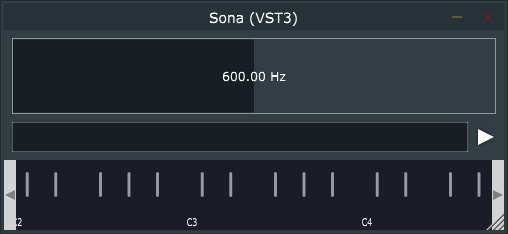
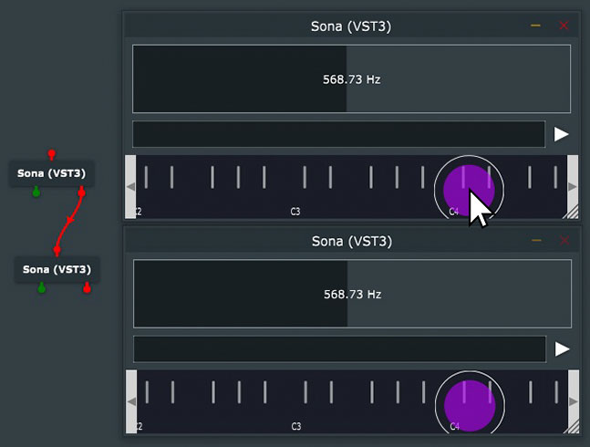
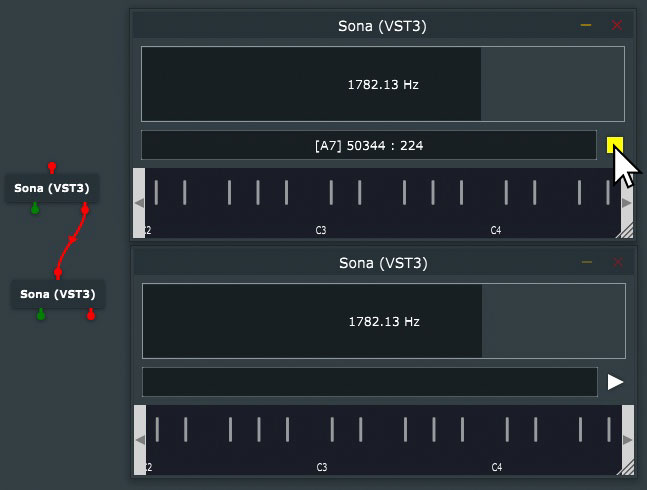

Tiny [JUCE](https://github.com/juce-framework/JUCE) VST plugin to generate tones
and MIDI at exact frequencies, analyze frequency of incoming MIDI, and send MIDI
notes of exact frequencies from the MPE GUI keyboard or slider and toggle button.

_Frequency resolution is capped to +-2 semitone 14-bit pitchbend range of midi.
The displayed frequency is always accurate, and will update to the (potentially
discretized) tone frequency when playback starts._

## Usage
1) 

1a. Send MPE Midi notes with the GUI keyboard (upper) 
1b. Read frequency and MPE position of incoming midi

2) 

Generate constant tone and midi (as closest root + pitchbend) at set frequency. Log note and exact start time, as `[buffer : sample]` (since plugin init). Useful to reference delays if another plugin is start-synced.

## Build with CMake

_On Windows, I recommend clang-cl, but MSVC should also work fine for just this project._

* Install JUCE as a system library, using vcpkg, or pull its [git repo](https://github.com/juce-framework/JUCE) into the project directory
* If installed system wide, swap the comments in `CMakeLists.txt:15` to use FindPackage
* Optionally build the plugin host in JUCE/extras, refer to the JUCE manual.
* Optionally, set a directory to copy the plugin after build, e.g. `-DJUCE_VST3_COPY_DIR=/path/to/vsts/`

To build as another plugin format than VST3, ie. AAX or standalone, just change the JUCE plugin FORMATS setting
in `CMakeLists.txt:35` and refer to the JUCE docs for any specific quirks.
